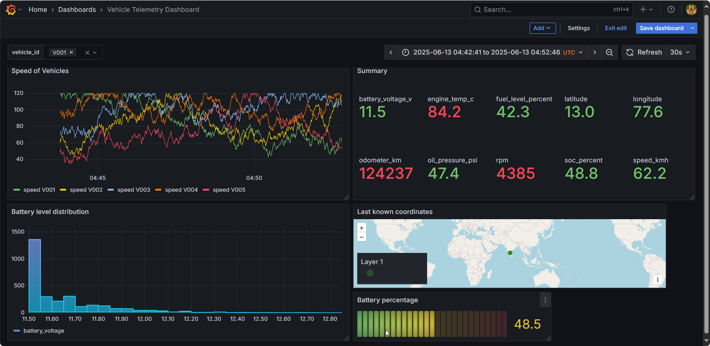

# Build & Visualize a Telemetry API with Grafana

## Overview

This project implements a real-time vehicle telemetry system using FastAPI for a high-performance API, Docker for containerization, and Grafana for data visualization and alerting. It simulates vehicle data (speed, RPM, engine temperature, lat&long, battery SoC, etc.) and exposes it via a REST API, which Grafana consumes to display live dashboards and trigger alerts.

## Setup & Running the Project

**Prerequisites:**

*   Docker Desktop installed.

## Installation

1.  **Clone the repository.**
2.  **Build and run services:**

    ```bash
    docker-compose up --build
    ```

3.  **Access services:**

    After a successful build, FastAPI is accessible on `localhost:8000`, and Grafana is available on `localhost:3000`.

## API Endpoints

The FastAPI application provides data via the following endpoints:

**Base URL:** `http://localhost:8000`

1.  **API Status:** `http://localhost:8000/`
2.  **List all available metrics:** `http://localhost:8000/metrics`
3.  **Get latest telemetry for all vehicles:** `http://localhost:8000/data`
4.  **Get Latest Telemetry for a Specific Vehicle:** `http://localhost:8000/data/V001`
5.  **Get filtered data:**

    *   `http://localhost:8000/data?metric=speed_kmh`:  Returns speed values with timestamp and vehicle name. Replace `speed_kmh` with other metrics.
    *   `http://localhost:8000/data?metric=rpm&agg=avg`: Returns the average RPM value.
    *   `http://localhost:8000/data?metric=speed_kmh&vehicle_id=V001&agg=min`: Returns the minimum speed of vehicle V001.
    *   `http://localhost:8000/data?metric=speed_kmh&from_ts={timestamp}&to_ts={timestamp}`: Returns the speed of all vehicles within the specified time range.

## Dashboard Preview

Here's a preview of the live Grafana dashboard:


